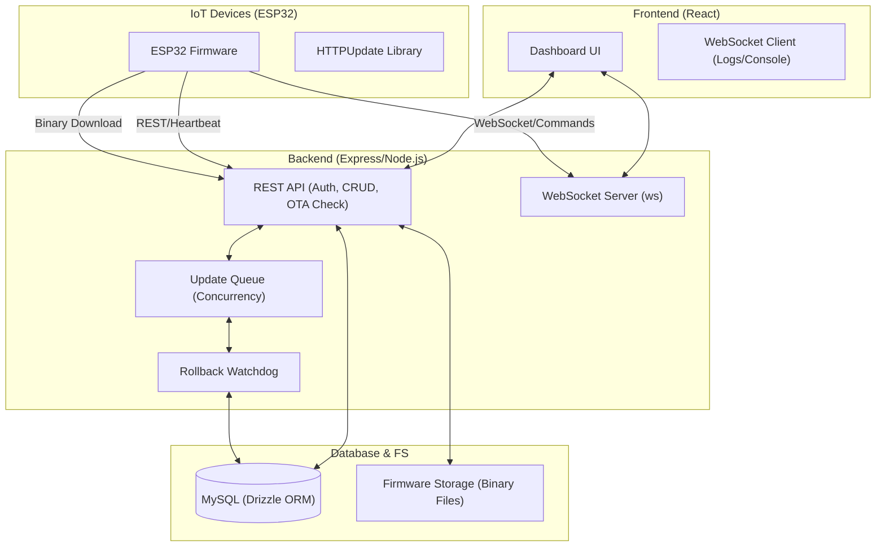
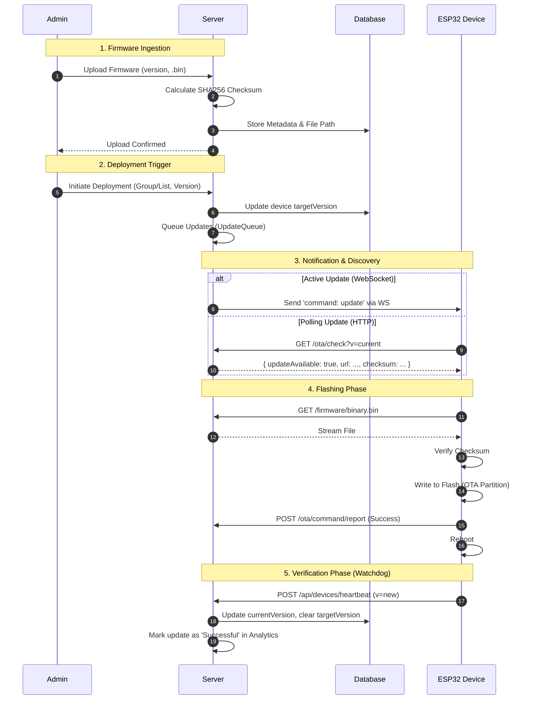

# Universal OTA: Enterprise Firmware Management Platform

A robust, full-stack Over-The-Air (OTA) update solution designed for ESP32 IoT fleets. This platform handles device management, firmware versioning, staged rollouts, and real-time monitoring with a modern React dashboard and an Express.js backend.

---

## 🚀 Features

- **Fleet Management**: Real-time tracking of online/offline status, signal strength, and health metrics.
- **Firmware Versioning**: Upload and manage multiple firmware versions with SHA256 integrity checks.
- **Staged Rollouts**: Deploy updates incrementally (e.g., 5% -> 25% -> 100%) with auto-rollback on failure.
- **OTA Updates**: Supports both WebSocket-triggered (push) and HTTP polling (pull) update mechanisms.
- **Remote Console**: Send direct commands (reboot, reset) and view live serial logs via WebSocket.
- **Audit Logs**: Comprehensive tracking of all admin actions for compliance.
- **Security Check**: Role-based access, PIN authentication, and signed binary verification.

---

## 🛠 Tech Stack

### Frontend
- **Framework**: [React](https://react.dev/) + [Vite](https://vitejs.dev/)
- **UI Library**: [Shadcn UI](https://ui.shadcn.com/) (Tailwind CSS)
- **State/Data**: [TanStack Query](https://tanstack.com/query/latest)
- **Routing**: [Wouter](https://github.com/molefrog/wouter)
- **Visualization**: Recharts (Analytics), Leaflet (Maps)

### Backend
- **Runtime**: [Node.js](https://nodejs.org/) (Express)
- **Language**: TypeScript throughout (Full-stack type safety)
- **Database**: MySQL (via [Drizzle ORM](https://orm.drizzle.team/))
- **Communication**: WebSocket (`ws`) for real-time events

---

## 📂 Project Structure

```
├── client/                 # Frontend React Application
│   ├── src/
│   │   ├── components/     # UI Components (Shadcn + Custom)
│   │   ├── hooks/          # React Hooks (useDeviceUpdates, etc.)
│   │   ├── pages/          # Application Routes (Dashboard, Devices, Logs)
│   │   └── lib/            # Utilities (API, Auth, Theme)
│
├── server/                 # Backend Application
│   ├── db-storage.ts       # Database Implementation (Drizzle)
│   ├── routes.ts           # REST API Endpoints
│   ├── ws-manager.ts       # WebSocket Server Logic
│   ├── updateQueue.ts      # Concurrency Management
│   └── firmware/           # Binary Storage Directory
│
└── shared/                 # Shared Code
    └── schema.ts           # Drizzle Schema & Zod Types (Single Source of Truth)
```

---

## ⚡ Getting Started

### Prerequisites
- Node.js v18+
- MySQL Server (Ensure `ota_db` exists)

### Installation

1.  **Install Dependencies**
    ```bash
    npm install
    ```

2.  **Database Setup**
    The application defaults to the following credentials (edit `server/db-storage.ts` or set env vars):
    - Host: `40.192.42.60`
    - User: `testing`
    - Pass: `testing@2025`
    - DB: `ota_db`

    Run migrations (if applicable) or ensure the schema is synced:
    ```bash
    npm run db:push
    ```

3.  **Run Development Server**
    Starts both Client (Vite) and Server (Express):
    ```bash
    npm run dev
    ```
    Access the dashboard at `http://localhost:5000`.

---

## 🏗 System Architecture

The platform follows a classic three-tier architecture with a specialized IoT communication layer.



### Component Breakdown

| Component | Responsibility |
| :--- | :--- |
| **Frontend UI** | Admin administration, firmware management, rollout monitoring, and remote console. |
| **REST API** | Handles device registration, heartbeats, OTA polling (`/ota/check`), and firmware uploads. |
| **WebSocket Server** | Real-time bi-directional channel for streaming device logs and sending instant commands (Reboot, Reset). |
| **Update Queue** | Manages thousands of devices by queuing update requests to prevent server/network congestion. |
| **Rollback Watchdog** | Monitors devices after an update. If a device fails to check back in within a timeout, it marks it as "At Risk" or initiates a rollback. |
| **Drizzle ORM** | Provides type-safe access to the MySQL database for device status, firmware metadata, and audit logs. |

---

## 🔄 OTA Update Lifecycle

The following sequence diagram illustrates the complete flow from firmware upload to successful deployment.



### Reliability Mechanisms

1.  **Checksum Verification**: Every binary is hashed (SHA256). The device verifies this hash *after* downloading but *before* flashing to prevent bricking from corrupted transfers.
2.  **Staged Rollouts**: Deployments can be limited to target percentages (e.g., 5% first). If failure rates exceed a threshold, the server automatically pauses the rollout.
3.  **Atomic Updates**: ESP32 uses an A/B partition scheme. The new firmware is written to the "next" partition. If it fails, the bootloader automatically reverts to the "previous" partition.
4.  **Rollback Watchdog**: If a device reboots but doesn't send a heartbeat within 10 minutes, the server flags it for manual intervention or marks the version as unstable.

---

## 🔒 Security Model

- **Device Identity**: Devices are identified by hardware MAC addresses (normalized to uppercase, no colons).
- **Admin Access**: Protected by session-based authentication with PIN hashing (SHA256).
- **Communication Security**: 
    - All external webhooks can be signed with a shared secret.
    - Rate limiting is applied to OTA polling and download endpoints to prevent DDoS.
